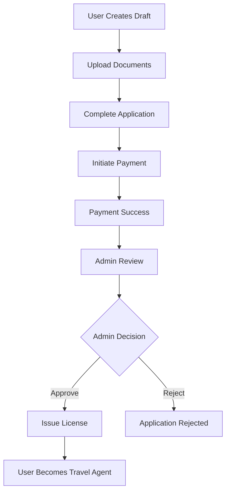

# Travel Agent Module - Complete API Documentation

## Overview

The Travel Agent Module provides a comprehensive system for managing travel agents, their clients, and upgrade applications. This module enables regular users to upgrade to travel agent status through a structured application process with document verification and admin approval.

## Table of Contents

1. [Module Architecture](#module-architecture)
2. [Travel Agent Management](#travel-agent-management)
3. [Travel Agent Upgrade System](#travel-agent-upgrade-system)
4. [API Endpoints Reference](#api-endpoints-reference)
5. [Application Flow](#application-flow)
6. [Authentication & Authorization](#authentication--authorization)
7. [Error Handling](#error-handling)
8. [File Upload System](#file-upload-system)
9. [Database Schema](#database-schema)

---

## Module Architecture

### Core Components

- **TravelAgentModule** - Main travel agent functionality
- **TravelAgentUpgradeModule** - Upgrade application system
- **Controllers**: Travel agent management, upgrade applications, admin operations
- **Services**: Business logic, file handling, payment processing
- **DTOs**: Request/response validation and serialization

### Key Features

- ✅ **Client Management** - Travel agents can manage their clients
- ✅ **Application Processing** - Handle visa applications on behalf of clients
- ✅ **Upgrade System** - Users can apply to become travel agents
- ✅ **Document Management** - Secure file upload and storage
- ✅ **Payment Integration** - Service fees and upgrade payments
- ✅ **License Management** - Unique agent licenses with renewal system
- ✅ **Admin Dashboard** - Review and approve upgrade applications

---

## Travel Agent Management

### Core Functionality

Travel agents (users with `AGENCY` role) can:

1. **Manage Clients**

   - View client list with analytics
   - Track client application history
   - Add notes and priority levels
   - Monitor client performance

2. **Process Applications**

   - Submit visa applications for clients
   - Track application status
   - Manage application documents
   - Monitor processing progress

3. **Analytics & Reporting**
   - Client performance metrics
   - Application success rates
   - Revenue analytics
   - Processing statistics

### API Endpoints

#### Client Management

```http
GET /travel-agent/clients
```

**Description**: Get paginated list of clients with optional filtering
**Authentication**: Required (AGENCY role)
**Query Parameters**:

- `page` (number, optional): Page number (default: 1)
- `limit` (number, optional): Items per page (default: 20)
- `search` (string, optional): Search by client name or email

**Response**:

```json
{
  "success": true,
  "data": {
    "clients": [
      {
        "id": "user123",
        "firstName": "John",
        "lastName": "Doe",
        "email": "john.doe@example.com",
        "totalApplications": 5,
        "successfulApplications": 4,
        "lastApplicationDate": "2025-01-20T10:30:00.000Z"
      }
    ],
    "pagination": {
      "page": 1,
      "limit": 20,
      "total": 50,
      "totalPages": 3
    }
  }
}
```

#### Application Management

```http
GET /travel-agent/applications
```

**Description**: Get applications submitted by the travel agent
**Authentication**: Required (AGENCY role)
**Query Parameters**:

- `page` (number, optional): Page number
- `limit` (number, optional): Items per page
- `search` (string, optional): Search by reference number, form name, or client email
- `status` (string, optional): Filter by application status
- `dateFrom` (string, optional): Start date filter (ISO format)
- `dateTo` (string, optional): End date filter (ISO format)

**Response**:

```json
{
  "success": true,
  "data": {
    "applications": [
      {
        "id": "app123",
        "referenceNumber": "REF-2025-001",
        "formName": "Tourist Visa Application",
        "clientName": "John Doe",
        "clientEmail": "john.doe@example.com",
        "status": "IN_PROGRESS",
        "submittedAt": "2025-01-20T10:30:00.000Z",
        "paymentStatus": "COMPLETED"
      }
    ],
    "pagination": {
      "page": 1,
      "limit": 20,
      "total": 25,
      "totalPages": 2
    }
  }
}
```

#### Analytics Dashboard

```http
GET /travel-agent/analytics/dashboard
```

**Description**: Get travel agent performance analytics
**Authentication**: Required (AGENCY role)

**Response**:

```json
{
  "success": true,
  "data": {
    "totalClients": 50,
    "activeClients": 35,
    "totalApplications": 150,
    "successfulApplications": 120,
    "successRate": 80.0,
    "monthlyRevenue": 2500000,
    "recentActivity": [
      {
        "type": "APPLICATION_SUBMITTED",
        "description": "Tourist visa application submitted for John Doe",
        "timestamp": "2025-01-20T10:30:00.000Z"
      }
    ]
  }
}
```

---

## Travel Agent Upgrade System

### Overview

The upgrade system allows regular users to apply for travel agent status through a structured process:

1. **Draft Application** - Initial application with basic information
2. **Document Upload** - Required documents (CAC, Tax Clearance, etc.)
3. **Application Completion** - Finalize with bank details and directors
4. **Payment** - Pay upgrade fee
5. **Admin Review** - Admin reviews and approves/rejects
6. **License Issuance** - Automatic license generation upon approval

### Application Flow



### Status Transitions

```
DRAFT → PENDING → PENDING_PAYMENT → PENDING_REVIEW → UNDER_REVIEW → APPROVED/REJECTED
```

---

## API Endpoints Reference

### User Endpoints (Travel Agent Upgrade)

#### 1. Create Draft Application

```http
POST /travel-agent/upgrade/draft
```

**Description**: Create a draft travel agent upgrade application
**Authentication**: Required
**Request Body**:

```json
{
  "companyName": "ABC Travel Agency",
  "companyEmail": "contact@abctravel.com",
  "companyPhone": "+2348012345678",
  "cacNumber": "RC123456789",
  "tinNumber": "12345678901",
  "nahconLicenseNumber": "NAHCON123456",
  "dssClearanceNumber": "DSS789012",
  "efccScumlNumber": "SCUML345678",
  "iataAccreditationNumber": "IATA901234",
  "nantaMembershipNumber": "NANTA567890"
}
```

**Response**:

```json
{
  "success": true,
  "message": "Draft application created successfully",
  "data": {
    "application": {
      "id": "123e4567-e89b-12d3-a456-426614174000",
      "status": "DRAFT",
      "companyName": "ABC Travel Agency",
      "companyEmail": "contact@abctravel.com",
      "companyPhone": "+2348012345678",
      "createdAt": "2025-01-20T10:30:00.000Z"
    }
  }
}
```

#### 2. Upload Document

```http
POST /travel-agent/upgrade/documents/upload
```

**Description**: Upload required documents for upgrade application
**Authentication**: Required
**Content-Type**: `multipart/form-data`
**Form Data**:

- `file` (binary): Document file (PDF, JPEG, PNG)
- `applicationId` (string): Application ID
- `documentType` (string): Document type (CAC_DOCUMENT, TAX_CLEARANCE_CERTIFICATE, etc.)

**Supported Document Types**:

- `CAC_DOCUMENT` - CAC Registration Certificate
- `TAX_CLEARANCE_CERTIFICATE` - Tax Clearance Certificate
- `NAHCON_DOCUMENT` - NAHCON License Document
- `EFCC_SCUML_DOCUMENT` - EFCC SCUML Certificate
- `IATA_DOCUMENT` - IATA Accreditation Document

**File Requirements**:

- **File Types**: PDF, JPEG, PNG
- **Max Size**: 10MB
- **Status**: Only DRAFT applications can upload documents

**Response**:

```json
{
  "success": true,
  "message": "Document uploaded successfully",
  "data": {
    "documentType": "CAC_DOCUMENT",
    "fileName": "cac_certificate.pdf",
    "fileSize": 1024000,
    "mimeType": "application/pdf",
    "fileUrl": "/uploads/user123/travel-agent-cac_document_1640995200000_cac_certificate.pdf"
  }
}
```

#### 3. Complete Application

```http
PUT /travel-agent/upgrade/application/:id/complete
```

**Description**: Complete the upgrade application with final details
**Authentication**: Required
**Path Parameters**:

- `id` (string): Application ID

**Request Body**:

```json
{
  "cacNumber": "RC123456789",
  "tinNumber": "12345678901",
  "nahconLicenseNumber": "NAHCON123456",
  "dssClearanceNumber": "DSS789012",
  "efccScumlNumber": "SCUML345678",
  "iataAccreditationNumber": "IATA901234",
  "nantaMembershipNumber": "NANTA567890",
  "bankDetails": {
    "bankName": "Access Bank",
    "bankCode": "044",
    "accountNumber": "0123456789",
    "accountName": "ABC Travel Agency"
  },
  "directors": [
    {
      "nin": "12345678901",
      "dateOfBirth": "1990-01-01",
      "firstName": "John",
      "lastName": "Doe",
      "middleName": "Smith",
      "phoneNumber": "+2348012345678",
      "email": "john.doe@example.com"
    }
  ]
}
```

**Response**:

```json
{
  "success": true,
  "message": "Application completed successfully",
  "data": {
    "application": {
      "id": "123e4567-e89b-12d3-a456-426614174000",
      "status": "PENDING",
      "companyName": "ABC Travel Agency",
      "bankDetails": {
        "bankName": "Access Bank",
        "accountNumber": "0123456789"
      },
      "directors": [
        {
          "firstName": "John",
          "lastName": "Doe",
          "nin": "12345678901"
        }
      ]
    }
  }
}
```

#### 4. Initiate Payment

```http
POST /travel-agent/upgrade/application/:id/payment
```

**Description**: Initiate payment for upgrade application
**Authentication**: Required
**Path Parameters**:

- `id` (string): Application ID

**Request Body**:

```json
{
  "serviceFeeId": "upgrade-fee-123",
  "paymentMethodId": "paystack"
}
```

**Response**:

```json
{
  "success": true,
  "message": "Payment initiated successfully",
  "data": {
    "application": {
      "id": "123e4567-e89b-12d3-a456-426614174000",
      "status": "PENDING_PAYMENT",
      "paymentId": "payment-123"
    },
    "payment": {
      "id": "payment-123",
      "amount": 50000,
      "currency": "NGN",
      "status": "PENDING",
      "description": "Travel Agent Upgrade Application - Upgrade Fee"
    }
  }
}
```

#### 5. Get Application Status

```http
GET /travel-agent/upgrade/application
```

**Description**: Get current user's upgrade application
**Authentication**: Required

**Response**:

```json
{
  "success": true,
  "data": {
    "application": {
      "id": "123e4567-e89b-12d3-a456-426614174000",
      "status": "PENDING_REVIEW",
      "companyName": "ABC Travel Agency",
      "companyEmail": "contact@abctravel.com",
      "createdAt": "2025-01-20T10:30:00.000Z",
      "documents": {
        "cacDocumentUrl": "/uploads/user123/cac_document.pdf",
        "taxClearanceDocumentUrl": "/uploads/user123/tax_clearance.pdf"
      },
      "bankDetails": {
        "bankName": "Access Bank",
        "accountNumber": "0123456789"
      }
    }
  }
}
```

#### 6. Get License Information

```http
GET /travel-agent/upgrade/license
```

**Description**: Get travel agent license information
**Authentication**: Required

**Response**:

```json
{
  "success": true,
  "data": {
    "license": {
      "id": "license-123",
      "licenseNumber": "AGT-2025-000001",
      "status": "ACTIVE",
      "issuedAt": "2025-01-20T10:30:00.000Z",
      "expiresAt": "2026-01-20T10:30:00.000Z",
      "renewalRequired": false
    }
  }
}
```

### Admin Endpoints (Travel Agent Upgrade Management)

#### 1. List Applications

```http
GET /admin/travel-agent/upgrade/applications
```

**Description**: Get paginated list of upgrade applications
**Authentication**: Required (ADMIN or SUPER_ADMIN role)
**Query Parameters**:

- `status` (string, optional): Filter by status
- `page` (number, optional): Page number (default: 1)
- `limit` (number, optional): Items per page (default: 20)

**Response**:

```json
{
  "success": true,
  "data": {
    "applications": [
      {
        "id": "123e4567-e89b-12d3-a456-426614174000",
        "status": "PENDING_REVIEW",
        "companyName": "ABC Travel Agency",
        "companyEmail": "contact@abctravel.com",
        "createdAt": "2025-01-20T10:30:00.000Z",
        "user": {
          "id": "user123",
          "firstName": "John",
          "lastName": "Doe",
          "email": "john.doe@example.com"
        }
      }
    ],
    "pagination": {
      "page": 1,
      "limit": 20,
      "total": 50,
      "totalPages": 3
    }
  }
}
```

#### 2. Approve Application

```http
POST /admin/travel-agent/upgrade/applications/:id/approve
```

**Description**: Approve upgrade application and issue license
**Authentication**: Required (ADMIN or SUPER_ADMIN role)
**Path Parameters**:

- `id` (string): Application ID

**Request Body**:

```json
{
  "reviewNotes": "All documents verified and requirements met"
}
```

**Response**:

```json
{
  "success": true,
  "message": "Application approved and license issued",
  "data": {
    "application": {
      "id": "123e4567-e89b-12d3-a456-426614174000",
      "status": "APPROVED",
      "approvedAt": "2025-01-20T10:30:00.000Z",
      "approvedBy": "admin123"
    },
    "license": {
      "id": "license123",
      "licenseNumber": "AGT-2025-000001",
      "status": "ACTIVE",
      "issuedAt": "2025-01-20T10:30:00.000Z",
      "expiresAt": "2026-01-20T10:30:00.000Z"
    }
  }
}
```

#### 3. Reject Application

```http
POST /admin/travel-agent/upgrade/applications/:id/reject
```

**Description**: Reject upgrade application
**Authentication**: Required (ADMIN or SUPER_ADMIN role)
**Path Parameters**:

- `id` (string): Application ID

**Request Body**:

```json
{
  "rejectionReason": "Incomplete documentation",
  "reviewNotes": "Missing CAC document and bank verification"
}
```

**Response**:

```json
{
  "success": true,
  "message": "Application rejected",
  "data": {
    "application": {
      "id": "123e4567-e89b-12d3-a456-426614174000",
      "status": "REJECTED",
      "rejectedAt": "2025-01-20T10:30:00.000Z",
      "rejectedBy": "admin123",
      "rejectionReason": "Incomplete documentation"
    }
  }
}
```

#### 4. Get Application Details

```http
GET /admin/travel-agent/upgrade/applications/:id
```

**Description**: Get detailed application information
**Authentication**: Required (ADMIN or SUPER_ADMIN role)
**Path Parameters**:

- `id` (string): Application ID

**Response**:

```json
{
  "success": true,
  "data": {
    "application": {
      "id": "123e4567-e89b-12d3-a456-426614174000",
      "status": "PENDING_REVIEW",
      "companyName": "ABC Travel Agency",
      "companyEmail": "contact@abctravel.com",
      "companyPhone": "+2348012345678",
      "cacNumber": "RC123456789",
      "tinNumber": "12345678901",
      "createdAt": "2025-01-20T10:30:00.000Z",
      "documents": {
        "cacDocumentUrl": "/uploads/user123/cac_document.pdf",
        "taxClearanceDocumentUrl": "/uploads/user123/tax_clearance.pdf",
        "nahconDocumentUrl": "/uploads/user123/nahcon_document.pdf",
        "efccScumlDocumentUrl": "/uploads/user123/efcc_scuml_document.pdf"
      },
      "bankDetails": {
        "bankName": "Access Bank",
        "bankCode": "044",
        "accountNumber": "0123456789",
        "accountName": "ABC Travel Agency"
      },
      "directors": [
        {
          "firstName": "John",
          "lastName": "Doe",
          "nin": "12345678901",
          "dateOfBirth": "1990-01-01"
        }
      ],
      "user": {
        "id": "user123",
        "firstName": "John",
        "lastName": "Doe",
        "email": "john.doe@example.com"
      }
    }
  }
}
```

#### 5. Mark for Review

```http
PUT /admin/travel-agent/upgrade/applications/:id/review
```

**Description**: Mark application as under review
**Authentication**: Required (ADMIN or SUPER_ADMIN role)
**Path Parameters**:

- `id` (string): Application ID

**Request Body**:

```json
{
  "reviewNotes": "Application assigned for detailed review"
}
```

**Response**:

```json
{
  "success": true,
  "message": "Application marked for review",
  "data": {
    "application": {
      "id": "123e4567-e89b-12d3-a456-426614174000",
      "status": "UNDER_REVIEW",
      "reviewedBy": "admin123",
      "reviewNotes": "Application assigned for detailed review"
    }
  }
}
```

---

## Application Flow

### Complete User Journey

#### Step 1: Create Draft Application

1. User calls `POST /travel-agent/upgrade/draft`
2. Provides basic company information
3. Application status: `DRAFT`

#### Step 2: Upload Required Documents

1. User uploads documents via `POST /travel-agent/upgrade/documents/upload`
2. Required documents:
   - CAC Registration Certificate
   - Tax Clearance Certificate
   - NAHCON License Document
   - EFCC SCUML Certificate
   - IATA Accreditation (optional)
3. Documents are validated and stored securely

#### Step 3: Complete Application

1. User calls `PUT /travel-agent/upgrade/application/:id/complete`
2. Provides final details:
   - Bank account information
   - Director details (NIN, DOB, contact info)
   - Complete business information
3. Application status: `PENDING`

#### Step 4: Payment Processing

1. User initiates payment via `POST /travel-agent/upgrade/application/:id/payment`
2. Payment is processed through integrated payment gateway
3. Application status: `PENDING_PAYMENT` → `PENDING_REVIEW` (on payment success)

#### Step 5: Admin Review Process

1. Admin views applications via `GET /admin/travel-agent/upgrade/applications`
2. Admin reviews application details via `GET /admin/travel-agent/upgrade/applications/:id`
3. Admin can mark for review via `PUT /admin/travel-agent/upgrade/applications/:id/review`
4. Application status: `UNDER_REVIEW`

#### Step 6: Final Decision

1. **Approval**: Admin calls `POST /admin/travel-agent/upgrade/applications/:id/approve`

   - User role changes to `AGENCY`
   - Travel agent license is automatically generated
   - License is valid for 1 year
   - Application status: `APPROVED`

2. **Rejection**: Admin calls `POST /admin/travel-agent/upgrade/applications/:id/reject`
   - Application status: `REJECTED`
   - User remains with original role
   - Rejection reason is recorded

### Status Flow Diagram

```
DRAFT
  ↓ (upload documents)
DRAFT
  ↓ (complete application)
PENDING
  ↓ (initiate payment)
PENDING_PAYMENT
  ↓ (payment success)
PENDING_REVIEW
  ↓ (admin assigns reviewer)
UNDER_REVIEW
  ↓ (admin decision)
APPROVED/REJECTED
```

---

## Privacy & Security

### Application Status Privacy

The system implements strict privacy controls to protect user data:

#### 🔒 **Private Statuses (Not Visible to Authorities)**
- **`DRAFT`** - User is still working on application
- **`PENDING_PAYMENT`** - User submitted but payment not confirmed
- **`CANCELLED`** - User cancelled their own application

#### 🌐 **Public Statuses (Visible to Authorities)**
- **`SUBMITTED`** - Application is ready for processing
- **`UNDER_REVIEW`** - Being reviewed by verification officers
- **`FLAGGED`** - Flagged for security review
- **`QUERIED`** - Has issues that need resolution
- **`PROCESSING`** - Embassy is processing
- **`PENDING_BIOMETRICS`** - Waiting for biometric capture
- **`APPROVED`** - Final approved state
- **`REJECTED`** - Final rejected state

### Privacy Protection Implementation

#### Authority Dashboard
- **Automatic Filtering**: Private statuses are automatically excluded
- **No Override**: Authorities cannot access private applications even with explicit filters
- **User Protection**: Users can work on applications privately without oversight

#### Frontdesk Dashboard
- **Same Protection**: Frontdesk staff cannot see private applications
- **Appointment Filtering**: Only applications with confirmed appointments are visible
- **Status Validation**: Private statuses return empty results

#### User Dashboard
- **Full Access**: Users can see all their own applications regardless of status
- **Ownership Validation**: Users can only access their own applications
- **Status Transparency**: Users see the true status of their applications

### Security Considerations

#### Data Protection
- **Status-Based Access**: Access control based on application status
- **Role-Based Filtering**: Different roles see different application sets
- **Audit Trail**: All access attempts are logged for security monitoring

#### Privacy Compliance
- **User Consent**: Users understand which statuses are private
- **Data Minimization**: Only necessary data is exposed to authorities
- **Transparency**: Clear documentation of privacy controls

---

## Authentication & Authorization

### User Authentication

- **Bearer Token**: All endpoints require valid JWT token
- **User Context**: Current user information available via `@CurrentUser()` decorator

### Role-Based Access Control

#### Travel Agent Endpoints

- **Required Role**: `AGENCY`
- **Endpoints**: All `/travel-agent/*` endpoints (except upgrade endpoints)
- **Purpose**: Manage clients and process applications

#### Upgrade Application Endpoints

- **Required Role**: Any authenticated user
- **Endpoints**: `/travel-agent/upgrade/*`
- **Purpose**: Apply for travel agent status

#### Admin Endpoints

- **Required Role**: `ADMIN` or `SUPER_ADMIN`
- **Endpoints**: `/admin/travel-agent/upgrade/*`
- **Purpose**: Review and manage upgrade applications

### Permission Matrix

| Endpoint Category       | User Role         | Access Level          |
| ----------------------- | ----------------- | --------------------- |
| Travel Agent Management | AGENCY            | Full Access           |
| Upgrade Applications    | Any User          | Full Access           |
| Admin Operations        | ADMIN/SUPER_ADMIN | Full Access           |
| Client Data             | AGENCY            | Own Clients Only      |
| Application Data        | Any User          | Own Applications Only |

---

## Error Handling

### Standard Error Response Format

```json
{
  "success": false,
  "message": "Error description",
  "error": {
    "code": 400000,
    "message": "Detailed error message",
    "details": "Additional error context"
  },
  "timestamp": "2025-01-20T10:30:00.000Z"
}
```

### Common Error Scenarios

#### 1. Validation Errors (400 Bad Request)

```json
{
  "success": false,
  "message": "Validation failed",
  "error": {
    "code": 400000,
    "message": "Invalid document type. Allowed types: CAC_DOCUMENT, TAX_CLEARANCE_CERTIFICATE, NAHCON_DOCUMENT, EFCC_SCUML_DOCUMENT, IATA_DOCUMENT"
  }
}
```

#### 2. Authentication Errors (401 Unauthorized)

```json
{
  "success": false,
  "message": "Unauthorized",
  "error": {
    "code": 401000,
    "message": "Invalid or expired token"
  }
}
```

#### 3. Authorization Errors (403 Forbidden)

```json
{
  "success": false,
  "message": "Forbidden",
  "error": {
    "code": 403000,
    "message": "Insufficient permissions. Required role: AGENCY"
  }
}
```

#### 4. Not Found Errors (404 Not Found)

```json
{
  "success": false,
  "message": "Application not found",
  "error": {
    "code": 404000,
    "message": "Upgrade application not found"
  }
}
```

#### 5. File Upload Errors (400 Bad Request)

```json
{
  "success": false,
  "message": "File upload failed",
  "error": {
    "code": 400000,
    "message": "File size too large. Maximum size is 10MB"
  }
}
```

### Error Code Reference

| Code   | Description                                 |
| ------ | ------------------------------------------- |
| 400000 | Bad Request - Validation Error              |
| 401000 | Unauthorized - Authentication Required      |
| 403000 | Forbidden - Insufficient Permissions        |
| 404000 | Not Found - Resource Not Found              |
| 409000 | Conflict - Resource Already Exists          |
| 422000 | Unprocessable Entity - Business Logic Error |
| 500000 | Internal Server Error - System Error        |

---

## File Upload System

### File Storage Architecture

#### Storage Location

- **Local Storage**: `/uploads/{userId}/{filename}`
- **Production**: `/app/uploads/{userId}/{filename}`
- **Development**: `./uploads/{userId}/{filename}`

#### File Naming Convention

```
{fieldId}_{timestamp}_{sanitizedOriginalName}
```

Example: `travel-agent-cac_document_1640995200000_cac_certificate.pdf`

#### Static File Serving

- **URL Pattern**: `/uploads/{userId}/{filename}`
- **Middleware**: Express static file serving
- **Security**: User-specific directories prevent unauthorized access

### File Upload Process

#### 1. Validation

```typescript
// File type validation
const allowedMimeTypes = [
  'application/pdf',
  'image/jpeg',
  'image/png',
  'image/jpg',
];

// File size validation
const maxSize = 10 * 1024 * 1024; // 10MB

// Document type validation
const allowedDocumentTypes = [
  'CAC_DOCUMENT',
  'TAX_CLEARANCE_CERTIFICATE',
  'NAHCON_DOCUMENT',
  'EFCC_SCUML_DOCUMENT',
  'IATA_DOCUMENT',
];
```

#### 2. Storage Process

```typescript
// Create user directory
const userDir = path.join(uploadsDir, userId);
fs.mkdirSync(userDir, { recursive: true });

// Generate unique filename
const fileName = `${fieldId}_${timestamp}_${sanitizedFileName}`;

// Save file
const filePath = path.join(userDir, fileName);
fs.writeFileSync(filePath, file.buffer);

// Return relative URL
return `/uploads/${userId}/${fileName}`;
```

#### 3. Database Update

```typescript
// Update application with document URL
const data = {
  cacDocumentUrl: fileUrl, // For CAC_DOCUMENT
  taxClearanceDocumentUrl: fileUrl, // For TAX_CLEARANCE_CERTIFICATE
  nahconDocumentUrl: fileUrl, // For NAHCON_DOCUMENT
  efccScumlDocumentUrl: fileUrl, // For EFCC_SCUML_DOCUMENT
  iataDocumentUrl: fileUrl, // For IATA_DOCUMENT
};
```

### Security Considerations

#### File Validation

- **MIME Type Checking**: Prevents malicious file uploads
- **File Size Limits**: Prevents storage abuse
- **File Extension Validation**: Additional security layer

#### Access Control

- **User Isolation**: Files stored in user-specific directories
- **Authentication Required**: All uploads require valid authentication
- **Application Ownership**: Users can only upload to their own applications

#### File Cleanup

- **Automatic Cleanup**: Files can be cleaned up when applications are deleted
- **Storage Monitoring**: Monitor storage usage and implement cleanup policies

---

## Database Schema

### Core Tables

#### TravelAgentUpgradeApplication

```sql
CREATE TABLE travel_agent_upgrade_applications (
  id UUID PRIMARY KEY DEFAULT gen_random_uuid(),
  user_id UUID NOT NULL REFERENCES users(id),
  status upgrade_application_status NOT NULL DEFAULT 'DRAFT',

  -- Company Information
  company_name VARCHAR(255) NOT NULL,
  company_email VARCHAR(255) NOT NULL,
  company_phone VARCHAR(20) NOT NULL,

  -- Registration Details
  cac_number VARCHAR(50),
  tin_number VARCHAR(20),
  nahcon_license_number VARCHAR(50),
  dss_clearance_number VARCHAR(50),
  efcc_scuml_number VARCHAR(50),
  iata_accreditation_number VARCHAR(50),
  nanta_membership_number VARCHAR(50),

  -- Document URLs
  cac_document_url TEXT,
  tax_clearance_document_url TEXT,
  nahcon_document_url TEXT,
  efcc_scuml_document_url TEXT,
  iata_document_url TEXT,

  -- Payment Information
  payment_id UUID REFERENCES payments(id),

  -- Review Information
  reviewed_by UUID REFERENCES users(id),
  reviewed_at TIMESTAMP,
  review_notes TEXT,
  rejection_reason TEXT,

  -- Timestamps
  created_at TIMESTAMP DEFAULT NOW(),
  updated_at TIMESTAMP DEFAULT NOW()
);
```

#### TravelAgentLicense

```sql
CREATE TABLE travel_agent_licenses (
  id UUID PRIMARY KEY DEFAULT gen_random_uuid(),
  user_id UUID NOT NULL REFERENCES users(id),
  license_number VARCHAR(20) UNIQUE NOT NULL,
  status travel_agent_license_status NOT NULL DEFAULT 'ACTIVE',

  -- License Details
  issued_at TIMESTAMP NOT NULL,
  expires_at TIMESTAMP NOT NULL,
  issued_by UUID REFERENCES users(id),

  -- Timestamps
  created_at TIMESTAMP DEFAULT NOW(),
  updated_at TIMESTAMP DEFAULT NOW()
);
```

#### TravelAgentBankDetails

```sql
CREATE TABLE travel_agent_bank_details (
  id UUID PRIMARY KEY DEFAULT gen_random_uuid(),
  application_id UUID NOT NULL REFERENCES travel_agent_upgrade_applications(id),

  -- Bank Information
  bank_name VARCHAR(100) NOT NULL,
  bank_code VARCHAR(10) NOT NULL,
  account_number VARCHAR(20) NOT NULL,
  account_name VARCHAR(100) NOT NULL,

  -- Verification
  is_verified BOOLEAN DEFAULT FALSE,
  verified_at TIMESTAMP,

  -- Timestamps
  created_at TIMESTAMP DEFAULT NOW()
);
```

#### TravelAgentDirector

```sql
CREATE TABLE travel_agent_directors (
  id UUID PRIMARY KEY DEFAULT gen_random_uuid(),
  application_id UUID NOT NULL REFERENCES travel_agent_upgrade_applications(id),

  -- Director Information
  nin VARCHAR(20) NOT NULL,
  date_of_birth DATE NOT NULL,
  first_name VARCHAR(100) NOT NULL,
  last_name VARCHAR(100) NOT NULL,
  middle_name VARCHAR(100),
  phone_number VARCHAR(20),
  email VARCHAR(255),

  -- Verification
  is_verified BOOLEAN DEFAULT FALSE,
  verified_at TIMESTAMP,

  -- Timestamps
  created_at TIMESTAMP DEFAULT NOW()
);
```

### Enums

#### UpgradeApplicationStatus

```sql
CREATE TYPE upgrade_application_status AS ENUM (
  'DRAFT',
  'PENDING',
  'PENDING_PAYMENT',
  'PENDING_REVIEW',
  'UNDER_REVIEW',
  'APPROVED',
  'REJECTED',
  'CANCELLED'
);
```

#### TravelAgentLicenseStatus

```sql
CREATE TYPE travel_agent_license_status AS ENUM (
  'ACTIVE',
  'EXPIRED',
  'SUSPENDED',
  'REVOKED'
);
```

### Indexes

```sql
-- Performance indexes
CREATE INDEX idx_travel_agent_upgrade_applications_user_id ON travel_agent_upgrade_applications(user_id);
CREATE INDEX idx_travel_agent_upgrade_applications_status ON travel_agent_upgrade_applications(status);
CREATE INDEX idx_travel_agent_licenses_user_id ON travel_agent_licenses(user_id);
CREATE INDEX idx_travel_agent_licenses_license_number ON travel_agent_licenses(license_number);
CREATE INDEX idx_travel_agent_licenses_status ON travel_agent_licenses(status);
```

---

## Integration Examples

### Frontend Integration

#### React/Next.js Example

```typescript
// Create draft application
const createDraft = async (data: CreateDraftApplicationDto) => {
  const response = await fetch('/api/travel-agent/upgrade/draft', {
    method: 'POST',
    headers: {
      Authorization: `Bearer ${token}`,
      'Content-Type': 'application/json',
    },
    body: JSON.stringify(data),
  });
  return response.json();
};

// Upload document
const uploadDocument = async (
  file: File,
  applicationId: string,
  documentType: string,
) => {
  const formData = new FormData();
  formData.append('file', file);
  formData.append('applicationId', applicationId);
  formData.append('documentType', documentType);

  const response = await fetch('/api/travel-agent/upgrade/documents/upload', {
    method: 'POST',
    headers: {
      Authorization: `Bearer ${token}`,
    },
    body: formData,
  });
  return response.json();
};
```

#### Vue.js Example

```javascript
// Complete application
async completeApplication(applicationId, data) {
  try {
    const response = await this.$http.put(
      `/travel-agent/upgrade/application/${applicationId}/complete`,
      data,
      {
        headers: {
          'Authorization': `Bearer ${this.$store.getters.token}`
        }
      }
    );
    return response.data;
  } catch (error) {
    throw new Error(error.response.data.message);
  }
}
```

### Mobile Integration

#### React Native Example

```typescript
// Upload document with progress
const uploadDocument = async (
  file: any,
  applicationId: string,
  documentType: string,
) => {
  const formData = new FormData();
  formData.append('file', {
    uri: file.uri,
    type: file.type,
    name: file.fileName,
  });
  formData.append('applicationId', applicationId);
  formData.append('documentType', documentType);

  const response = await fetch('/api/travel-agent/upgrade/documents/upload', {
    method: 'POST',
    headers: {
      Authorization: `Bearer ${token}`,
      'Content-Type': 'multipart/form-data',
    },
    body: formData,
  });

  return response.json();
};
```

---

## Best Practices

### API Usage

#### 1. Error Handling

```typescript
try {
  const response = await api.createDraftApplication(data);
  if (response.success) {
    // Handle success
  } else {
    // Handle API error
    console.error(response.error.message);
  }
} catch (error) {
  // Handle network error
  console.error('Network error:', error.message);
}
```

#### 2. File Upload Best Practices

```typescript
// Validate file before upload
const validateFile = (file: File) => {
  const allowedTypes = ['application/pdf', 'image/jpeg', 'image/png'];
  const maxSize = 10 * 1024 * 1024; // 10MB

  if (!allowedTypes.includes(file.type)) {
    throw new Error('Invalid file type');
  }

  if (file.size > maxSize) {
    throw new Error('File too large');
  }

  return true;
};
```

#### 3. Status Management

```typescript
// Check application status before actions
const checkApplicationStatus = async (applicationId: string) => {
  const response = await api.getApplication(applicationId);
  const status = response.data.application.status;

  switch (status) {
    case 'DRAFT':
      // Allow document uploads
      break;
    case 'PENDING':
      // Allow payment initiation
      break;
    case 'PENDING_REVIEW':
      // Show waiting message
      break;
    case 'APPROVED':
      // Show success message
      break;
    case 'REJECTED':
      // Show rejection reason
      break;
  }
};
```

### Security Considerations

#### 1. Input Validation

- Always validate file types and sizes on both client and server
- Sanitize user inputs to prevent injection attacks
- Use proper authentication and authorization checks

#### 2. File Security

- Store files in user-specific directories
- Implement file type validation
- Consider virus scanning for uploaded files
- Implement file size limits

#### 3. Data Protection

- Encrypt sensitive data in transit and at rest
- Implement proper access controls
- Log all administrative actions
- Regular security audits

---

## Troubleshooting

### Common Issues

#### 1. File Upload Failures

**Problem**: File upload returns 400 error
**Solution**:

- Check file type (must be PDF, JPEG, PNG)
- Verify file size (max 10MB)
- Ensure application is in DRAFT status
- Validate document type parameter

#### 2. Authentication Errors

**Problem**: 401 Unauthorized errors
**Solution**:

- Verify JWT token is valid and not expired
- Check token format: `Bearer <token>`
- Ensure user has required role for endpoint

#### 3. Application Status Issues

**Problem**: Cannot perform action on application
**Solution**:

- Check current application status
- Verify status allows the requested action
- Ensure user owns the application

#### 4. Payment Processing

**Problem**: Payment initiation fails
**Solution**:

- Verify application is in PENDING status
- Check service fee configuration
- Ensure payment method is valid

### Debug Information

#### Enable Debug Logging

```typescript
// Add to environment variables
DEBUG=travel-agent:*
LOG_LEVEL=debug
```

#### Common Debug Queries

```sql
-- Check application status
SELECT id, status, created_at FROM travel_agent_upgrade_applications
WHERE user_id = 'user-id';

-- Check license status
SELECT license_number, status, expires_at FROM travel_agent_licenses
WHERE user_id = 'user-id';

-- Check file uploads
SELECT cac_document_url, tax_clearance_document_url
FROM travel_agent_upgrade_applications
WHERE id = 'application-id';
```

---

## Conclusion

The Travel Agent Module provides a comprehensive solution for managing travel agents and their upgrade process. The system includes:

- **Complete API Coverage**: All endpoints documented with examples
- **Secure File Handling**: Robust file upload and storage system
- **Role-Based Access**: Proper authentication and authorization
- **Admin Management**: Full admin control over upgrade process
- **License Management**: Automatic license generation and renewal
- **Error Handling**: Comprehensive error responses and debugging

This documentation serves as a complete reference for developers integrating with the Travel Agent Module API.

---

_Last Updated: January 2025_
_Version: 1.0.0_
