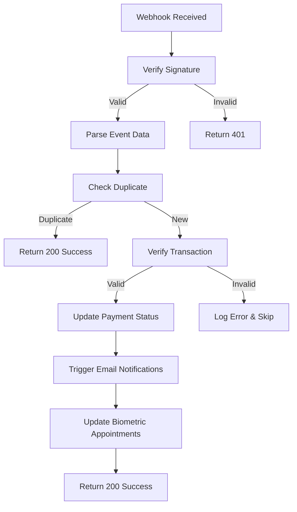

# Payment Webhooks Setup Guide

This guide covers the complete setup and configuration of payment webhooks for **Flutterwave**, **Paystack**, and **Fincra** in your NestJS application.

## 📋 Overview

Our webhook system provides:

- ✅ **Secure signature verification** for all providers
- ✅ **Idempotency handling** to prevent duplicate processing
- ✅ **Transaction verification** against local payment records
- ✅ **Automatic email notifications** via existing middleware
- ✅ **Comprehensive audit logging** for all webhook events
- ✅ **Consistent error handling** and response format

## 🏗️ Architecture

```
┌─────────────────┐    ┌──────────────────┐    ┌─────────────────┐
│ Payment Gateway │───▶│ Webhook Endpoint │───▶│ Handler Service │
│ (FLW/PS/Fincra) │    │ + Signature      │    │ + Verification  │
└─────────────────┘    │   Verification   │    │ + Processing    │
                       └──────────────────┘    └─────────────────┘
                                │                        │
                                ▼                        ▼
                       ┌──────────────────┐    ┌─────────────────┐
                       │ Raw Body + Sig   │    │ Payment Status  │
                       │ Extraction       │    │ Update + Email  │
                       └──────────────────┘    └─────────────────┘
```

## 🔐 Environment Configuration

### 1. Generate Secure Webhook Secrets

Run this command to generate secure secrets:

```bash
node -e "
const crypto = require('crypto');
console.log('# Add these to your .env file:');
console.log('FLUTTERWAVE_WEBHOOK_SECRET=' + crypto.randomBytes(32).toString('base64'));
console.log('PAYSTACK_WEBHOOK_SECRET=' + crypto.randomBytes(32).toString('base64'));
console.log('FINCRA_WEBHOOK_SECRET=' + crypto.randomBytes(32).toString('base64'));
"
```

### 2. Environment Variables

Add these to your `.env` file:

```env
# Webhook Secrets (generated above)
FLUTTERWAVE_WEBHOOK_SECRET=your_flutterwave_secret_here
PAYSTACK_WEBHOOK_SECRET=your_paystack_secret_here
FINCRA_WEBHOOK_SECRET=your_fincra_secret_here

# Your API base URL
API_BASE_URL=https://yourapi.com
```

## 🌐 Webhook Endpoints

| Provider    | Endpoint                       | Method | Headers Required        |
| ----------- | ------------------------------ | ------ | ----------------------- |
| Flutterwave | `/api/v1/webhooks/flutterwave` | POST   | `flutterwave-signature` |
| Paystack    | `/api/v1/webhooks/paystack`    | POST   | `x-paystack-signature`  |
| Fincra      | `/api/v1/webhooks/fincra`      | POST   | `signature`             |

## 🎛️ Provider Dashboard Setup

### 🟢 Flutterwave Setup

1. **Login** to [Flutterwave Dashboard](https://dashboard.flutterwave.com)
2. Go to **Settings** → **Webhooks**
3. **Add webhook URL**: `https://yourapi.com/api/v1/webhooks/flutterwave`
4. **Set secret**: Use the `FLUTTERWAVE_WEBHOOK_SECRET` you generated
5. **Select events**:
   - `charge.completed`
   - `charge.failed`
   - `transfer.completed`
   - `transfer.failed`

📚 **Reference**: [Flutterwave Webhook Documentation](https://developer.flutterwave.com/docs/webhooks)

### 🟡 Paystack Setup

1. **Login** to [Paystack Dashboard](https://dashboard.paystack.com)
2. Go to **Settings** → **API Keys & Webhooks**
3. **Add webhook URL**: `https://yourapi.com/api/v1/webhooks/paystack`
4. **Set secret**: Use the `PAYSTACK_WEBHOOK_SECRET` you generated
5. **Select events**:
   - `charge.success`
   - `charge.failed`
   - `transfer.success`
   - `transfer.failed`
   - `transfer.reversed`

📚 **Reference**: [Paystack Webhook Documentation](https://paystack.com/docs/payments/webhooks/)

### 🔵 Fincra Setup

1. **Login** to [Fincra Dashboard](https://app.fincra.com)
2. Go to **Account Settings** → **API Keys and Webhook**
3. **Add webhook URL**: `https://yourapi.com/api/v1/webhooks/fincra`
4. **Set secret**: Use the `FINCRA_WEBHOOK_SECRET` you generated
5. **Select events**:
   - `charge.successful`
   - `charge.failed`
   - `payout.successful`
   - `payout.failed`
   - `conversion.successful`
   - `virtual_account.credited`

📚 **Reference**: [Fincra Webhook Documentation](https://docs.fincra.com/docs/setup-webhook)

## 🔒 Security Features

### Signature Verification

| Provider    | Algorithm   | Header                  | Format |
| ----------- | ----------- | ----------------------- | ------ |
| Flutterwave | HMAC-SHA256 | `flutterwave-signature` | base64 |
| Paystack    | HMAC-SHA512 | `x-paystack-signature`  | hex    |
| Fincra      | HMAC-SHA512 | `signature`             | hex    |

### Verification Process

1. **Extract signature** from webhook headers
2. **Compute HMAC** using webhook secret and raw payload
3. **Compare signatures** using timing-safe comparison
4. **Reject invalid** signatures with 401 status

### Transaction Verification

For critical events (successful payments), we perform additional verification:

- ✅ **Amount matching** (with currency conversion)
- ✅ **Currency validation** against expected values
- ✅ **Reference verification** against local records
- ✅ **Status confirmation** before processing

## 📧 Email Notifications

Webhooks automatically trigger email notifications through existing middleware:

### Payment Confirmation Email

- **Triggered by**: Successful payment webhooks
- **Recipients**: Payment user
- **Template**: `payment-confirmation.hbs`

### Embassy Submission Email

- **Triggered by**: Application status → `APPROVED`
- **Recipients**: Applicant
- **Template**: `embassysubmission.hbs`

### Biometric Capture Email

- **Triggered by**: Appointment status → `COMPLETED`
- **Recipients**: Applicant
- **Template**: `biometriccapturing.hbs`

## 🔄 Idempotency & Duplicate Handling

Our system prevents duplicate processing:

1. **Check payment status** before processing
2. **Skip if already** in target status
3. **Log duplicate events** for audit trail
4. **Return success** for duplicates (idempotent)

## 📊 Event Processing Flow



## 🧪 Testing Webhooks

### Local Development

1. **Use ngrok** to expose local server:

   ```bash
   ngrok http 3000
   ```

2. **Update webhook URLs** in provider dashboards to ngrok URL

3. **Check logs** for webhook processing:
   ```bash
   npm run start:dev
   # Watch for webhook logs in console
   ```

### Production Testing

1. **Test with small amounts** first
2. **Monitor application logs** for webhook processing
3. **Check email delivery** for notifications
4. **Verify payment status updates** in database

## 🚨 Error Handling

### Common Issues & Solutions

| Issue                 | Cause                     | Solution                        |
| --------------------- | ------------------------- | ------------------------------- |
| 401 Invalid Signature | Wrong secret or algorithm | Verify secret matches dashboard |
| 400 Missing Payload   | Body parsing issue        | Check raw body middleware       |
| 404 Payment Not Found | Reference mismatch        | Verify reference format         |
| 500 Processing Error  | Database/email issues     | Check service dependencies      |

### Monitoring & Alerts

Set up monitoring for:

- ✅ **Webhook response times** (should be < 2s)
- ✅ **Failed signature verifications** (potential attacks)
- ✅ **Payment status mismatches** (data integrity)
- ✅ **Email delivery failures** (notification issues)

## 📈 Performance Optimizations

Our implementation includes:

- **Fast signature verification** with crypto libraries
- **Minimal database queries** for duplicate checking
- **Async email sending** to avoid blocking webhook response
- **Efficient event parsing** with type-safe DTOs
- **Connection pooling** for database operations

## 🎯 Supported Events

### Flutterwave Events

- `charge.completed` → Payment Success
- `charge.failed` → Payment Failed
- `transfer.completed` → Refund (if applicable)
- `transfer.failed` → Transfer Failed

### Paystack Events

- `charge.success` → Payment Success
- `charge.failed` → Payment Failed
- `transfer.success` → Refund/Transfer Success
- `transfer.failed` → Transfer Failed
- `transfer.reversed` → Transfer Reversal

### Fincra Events

- `charge.successful` → Payment Success
- `collection.successful` → Collection Success
- `charge.failed` → Payment Failed
- `payout.successful` → Payout/Refund Success
- `payout.failed` → Payout Failed
- `conversion.successful` → Currency Conversion
- `virtual_account.credited` → Virtual Account Payment

## 🛠️ Development Commands

```bash
# Build and test
npm run build
npm run test

# Start development server
npm run start:dev

# Generate webhook secrets
node scripts/generate-webhook-secrets.js

# Check webhook endpoints
curl -X GET https://yourapi.com/api/v1/webhooks/health
```

## 📚 Additional Resources

- [NestJS Documentation](https://docs.nestjs.com/)
- [Prisma Documentation](https://www.prisma.io/docs/)
- [Payment Provider Docs](#provider-dashboard-setup)
- [HMAC Security Best Practices](https://tools.ietf.org/html/rfc2104)

---

## 🎉 You're All Set!

Your payment webhook system is now production-ready with:

- ✅ **Multi-provider support** (Flutterwave, Paystack, Fincra)
- ✅ **Enterprise-grade security** with signature verification
- ✅ **Reliable processing** with idempotency and error handling
- ✅ **Automatic notifications** and status updates
- ✅ **Comprehensive logging** and monitoring capabilities

Happy webhooking! 🚀
